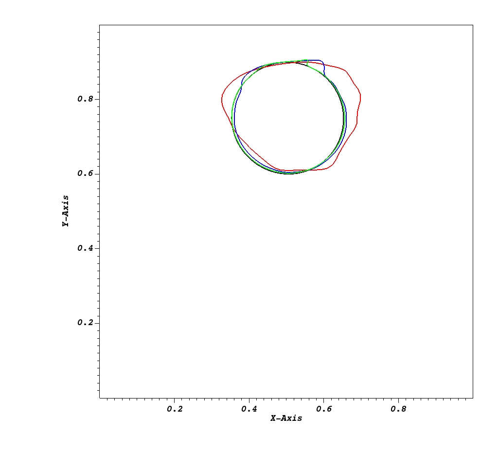
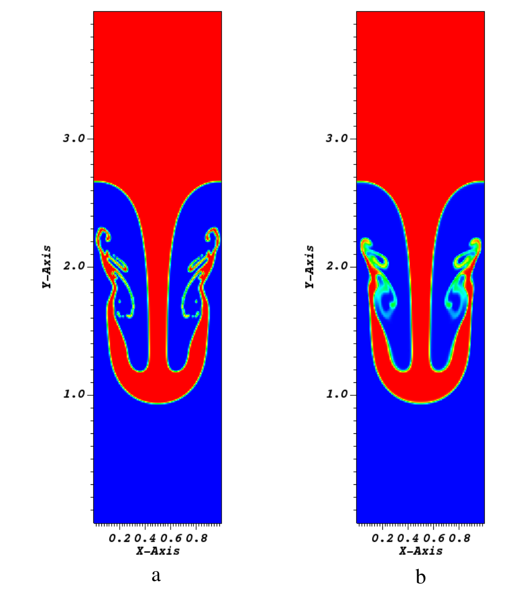
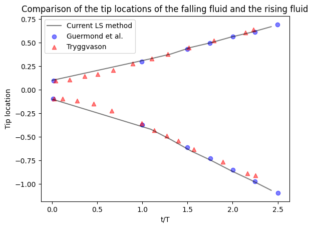
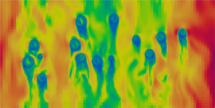

Introduction
===================

This IAMReX repo extends the capability of original `IAMR <https://amrex-fluids.github.io/IAMR/>`_ codes, aiming at simulating the multiphase incompressible flows and fluid structure interaction problems on both CPUs and GPUs with/without subcycling. The Navier-Stokes equations are solved on an adaptive semi-staggered grid using the projection method. The gas-liquid interface is captured using the level set (LS) method. The fluid-solid interface is resolved using the multidirect forcing immersed boundary method (IBM). The particle-wall as well as the particle-particle collisions are also captured by the adaptive collision time model (ACTM).

Features
------------------

Key software and algorithmic features of IAMR include:

* LS method and reinitialization schemes

* Multidirect forcing Immersed Boundary Method

* Particle Collision Algorithms with Discrete Element Method

Sample Cases
------------------

In the first case, we test the order of convergence for in a 2D reversed single vortex problem. 
A 2D circular drop with radius $R=0.15$ is placed at $(0.5,0.75)$ in a unit computational domain $[0, 1] \times [0, 1]$.
The velocity field is given by the stream function,

   .. math::
      :label: eq:stream_function

      \Psi(x, y, t)=\frac{1}{\pi} \sin ^{2}(\pi x) \sin ^{2}(\pi y) \cos \left(\frac{\pi t}{T}\right),

in which the rotational period is $T=4.0$. The velocities in the $x$ and $y$ directions are defined as $u(x,y,t)=\partial \Psi / \partial y$ and $v(x,y,t)=-\partial \Psi / \partial x$, respectively.
The periodic boundary condition is applied in both $x$ and $y$ directions. At $t=T$, the interfacial profile of the drop at the high resolution converges to its initial profile, which represents the exact solution. 
On the other hand, the circular shape of the drop is distorted for the simulation with low resolution.
Here is the case path : `RSV <https://github.com/ruohai0925/IAMReX/tree/development/Tutorials/RSV>`_.

    Profiles of drop interface in the Reverse Single Vortex (RSV) problem at t/T=1 after one rotation. Black line: Analytical Solution; Red line: 64*64; Blue line: 128*128; Green line: 256*256

Case path : `RayleighTaylor <https://github.com/ruohai0925/IAMReX/tree/development/Tutorials/RayleighTaylor_LS>`_.

    Density profile: a. Density profile at t/T=2.42 using LS method. b. Density profile at t/T=2.42 using IAMReX convective scheme.

    Comparison of the tip locations of the falling fluid and the rising fluid.

This case simulates fluid-particle interactions for 80 randomly distributed particles in a channel using multi-level AMR grids. By optimizing the interaction number (:math:`N_s=2`) in the immersed boundary method, it achieves a balance between accuracy and computational efficiency, with flow driven by a pressure gradient in the z-direction.
for more details, you can check :ref:`sec:ClusterParticles`.

Case path : `Monodisperse <https://github.com/ruohai0925/IAMReX/tree/development/Tutorials/Monodisperse>`_.

    Contours of velocity magnitude in yz plane
