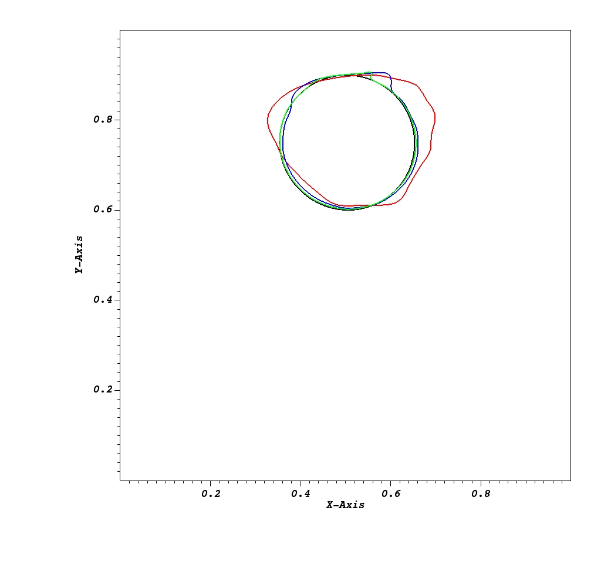

Introduction
===================

This IAMReX repo extends the capability of original `IAMR <https://amrex-fluids.github.io/IAMR/>`_ codes, aiming at simulating the multiphase incompressible flows and fluid structure interaction problems on both CPUs and GPUs with/without subcycling. The Navier-Stokes euqations are solved on an adaptive semi-staggered grid using the projection method. The gas-liquid interface is captured using the level set (LS) method. The fluid-solid interface is resolved using the multidirect forcing immersed boundary method (IBM). The particle-wall as well as the particle-particle collisions are also captured by the adaptive collision time model (ACTM).

Features
------------------

Key software and algorithmic features of IAMR include:

* LS method and reinitialization schemes

* Multidirect forcing Immersed Boundary Method

* Particle Collision Algorithms with Discrete Element Method

Figures
------------------

    Profiles of drop interface in the RSV problem at t/T=1 after one rotation. Black line: Analytical Solution; Red line: 64*64; Blue line: 128*128; Green line: 256*256

.. figure:: ./GettingStarted/IAMR_LSAMR.png
    :align: center
    :alt:  (a) Density profile at t/T=2.42 using LS method. (b) Density profile at t/T=2.42 using IAMR convective scheme. 
    :width: 5.00000in

    Density profile: a. Density profile at t/T=2.42 using LS method. b. Density profile at t/T=2.42 using IAMR convective scheme.

.. figure:: ./GettingStarted/RT_tip.png
    :align: center
    :alt:  Comparison of the tip locations of the falling fluid and the rising fluid.
    :width: 5.00000in

    Comparison of the tip locations of the falling fluid and the rising fluid.

.. figure:: ./GettingStarted/Monodisperse.png
    :align: center
    :width: 5.00000in

    Contours of velocity magnitude in yz plane 
