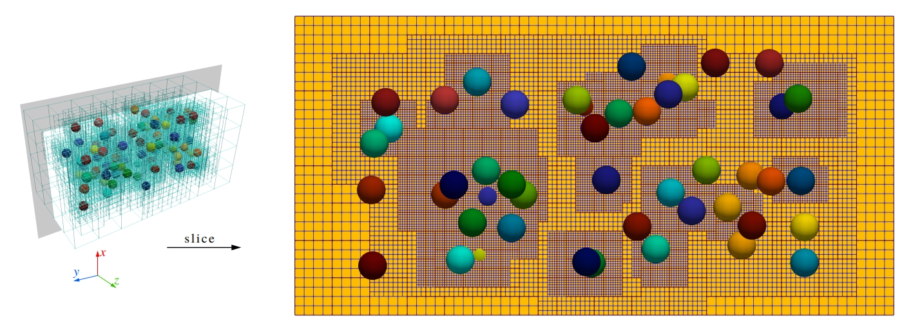
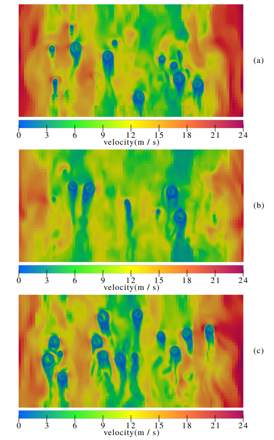
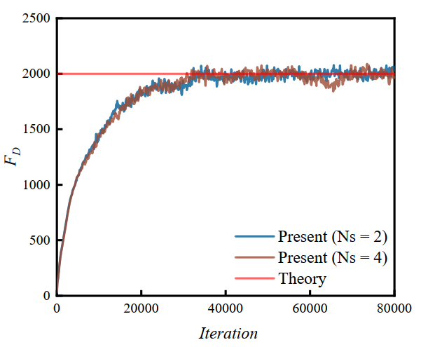

.. _Chap:Results:

Validation Cases
================

Flow Past Fixed Sphere
----------------------

.. Figure:: ./Results/FlowPastSphere.png
    :align: center
    :width: 5.0in

    The schematic of the flow passing through the spherical particles

we validate the accuracy and efficacy of our adaptive solver by simulating a spherical particle in uniform flow with different particle Reynolds numbers. The diameter of the particle is :math:`D_p = 1`, the computational domain is :math:`L_x \times L_y \times L_z = 20D_p \times 10D_p \times 10D_p`, the distance of the particle from the inlet is :math:`d = 5D_p` and located in the center of the yz plane. The inlet and outlet boundaries are applied in the x direction and the inlet velocity :math:`U` is :math:`1m/s`. Both y and z directions are periodic boundaries. 

The influence of AMR on the simulation results is investigated by using the subcycling method with different levels. As shown in Fig.

.. Figure:: ./Results/FlowPastSphereResult.png
    :align: center
    :width: 5.0in

    The drag coefficient of the particle under uniform flows varies with Particle Reynolds number at different AMR levels.

Three different types of grid were selected: level 0 indicates the single-level grid containing no AMR, level 1 indicates the two-level grid, and level 2 indicates the three-level grid. For all three types of grid, the ratio of the diameter of the particles to the grid spacing on the finest level is 16. The drag force, including the contributions of Lagrangian force and the PVF function, is calculated by

.. math::
    \mathbf{F}_D=-\rho_f \sum_{l=1}^{N_L} \mathbf{F}_l^{n+1/2} \Delta V_l+\rho_f \frac{d}{d t}\left(\int_{V_p} \mathbf{u} d V\right),

The theoretical S-N law for calculating the drag coefficient of the shaped particles is

.. math::
    C_D = (24/Re_p)(1+0.15Re_p^{0.687}),

which is proposed by schiller etal, and :math:`Re_p = UD_p/\nu` represents the particle Reynolds number. It can be seen from above Fig that the present results under different particle Reynolds numbers are in good agreement with S-N law. The fact that different levels of grid produce the nearly identical results validated the accuracy of our solver on the adaptive grid.

Cluster of monodisperse particles
---------------------------------

We demonstrate the accuracy and efficacy of our codes for simulating clusters of particles on the multi-level grid. As shown in Fig 

    Monodisperse particles on a three-level AMR grid

80 particles of diameter :math:`D = 1` are randomly distributed in a channel of size :math:`L_x\times L_y \times L_z = 10\times 20 \times 10`. To choose an optimal interaction number :math:`N_s` in this complex configuration, the maximum error of the no-slip boundary condition among 80 particles is tested with a unit flow field :math:`u=(1,0,0)`.the maximum error of no-slip condition decreases as :math:`N_s` increases and it is strongly reduced for :math:`N_s=2`. According to the selection suggestions provided by Breugem etal, :math:`N_s=2` is the optimal value for balancing the accuracy of the no-slip boundary and the computational efficiency. After determining :math:`N_s`, the fluid flow is driven by applying a pressure gradient of 1.0 in the z direction. This case can represent a porous medium with a volume fraction of 0.02. Three levels of the AMR grid is applied. The grid resolution on the finest level is :math:`d/h=16`. Since the multi-direct forcing immersed boundary method and fictitious domain method require cube grid cells, the grid cell requirement is equals to case 1 in Table.

    +------+---------+---------+---------+-------------+
    | case | level 0 | level 1 | level 2 | Total cells |
    +======+=========+=========+=========+=============+
    |   1  | 8192000 |         |         |   8192000   |
    +------+---------+---------+---------+-------------+
    |   2  |  128000 |  534656 | 1593664 |   2256320   |
    +------+---------+---------+---------+-------------+

Compared with them, our algorithm has a 72.5% grid reduction with :math:`d/h=16`. And it has a 62.5% Lagrangian markers reduction compared with the DLM method with :math:`d/h=16`.

When the simulation reaches the steady state, the total pressure drop balances the IB force generated by all particles in the streamwise z direction. Following the equation in akiki etal, the theoretical drag force is given by

.. math::
    F_{theory} = (\frac{\Delta p}{\Delta z}L_z)L_xL_y

Fig represents the velocity contour of three different interfaces in the x direction at the steady state. 

    Contours of velocity magnitude in :math:`yz` plane at the different x position: (a) x=2.5; (b) x=5.0; (c) x=7.5

The flow passes around the particles and generates the wakes behind. Fig. shows the time series of total IB force for all particles. The resistance gradually reaches a steady state after 40000 steps. In this case, the theoretical value of drag force given by :math:`F_{theory}` is 2000, while the present average values at steady state with :math:`N_s=2` and 4 are all converged around 2000. It indicates that :math:`N_s=2` is sufficient for this case. And the agreement between theory and present results validates the accuracy of our proposed framework in dealing with large amounts of particles in the fluid system. 

    Comparison of total drag force between the theory and present results with different :math:`N_s=2`
